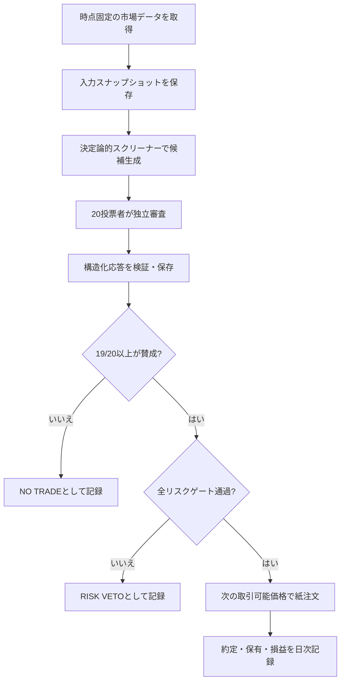

# 95%合意型AI投資ログ 実装・検証プラン

更新日: 2026-06-09

## 1. 目的

複数のAIモデルと分析観点から独立した投票を集め、設定された投票者全体の
95%以上が同じ新規投資に賛成した場合だけ、ペーパートレード上で注文候補を
成立させる。

主目的は利益の宣伝ではなく、次の問いを再現可能なログで検証することである。

- 単一のChatGPTより、異なるモデルを組み合わせた厳格な合意の方が安定するか。
- 単純多数決、75%合意、95%合意、全会一致で成績と取引頻度がどう変わるか。
- AIの合意そのものに効果があるのか、単なる厳しいフィルターなのか。
- 手数料、スリッページ、税引前損益を含めても比較対象を上回るか。

## 2. 参考にする先行事例

### Quorai

25のAI投資家を6つの投資流派に分け、人数だけでなく確信度も使って意見を
集約するオープンソースの研究用サンドボックス。実売買は行わないが、
エージェント別判断、バックテスト、トークン利用量を記録する構造が参考になる。

- https://quorai.github.io/

### Benchmarking Multi-LLM Investment Signals

Claude、DeepSeek、Geminiの日次シグナルを33営業日、1,220観測で比較した
2026年の研究。買い判断の方向精度は全会一致で57.1%、単純多数決で22.2%と
報告された。ただし標本が小さく、統計的有意性は確認されていない。

- https://papers.ssrn.com/sol3/papers.cfm?abstract_id=6515058

### 6-agent BTC council

6つの専門AIと最終判定を含む7条件すべてが通った場合だけ取引する、
実質的な全会一致方式。初期のペーパートレード成績は良いが、取引数が少なく、
全エージェントが同じ基盤モデルを使うため相関した誤りが課題となっている。

- https://www.reddit.com/r/algorithmictrading/comments/1sukz8m/

### ChatGPT Micro-Cap Experiment

ChatGPTに100ドルの実資金ポートフォリオを管理させ、日次CSV、取引履歴、
プロンプト、ベンチマーク比較を公開した事例。判断モデルよりも、後から検証
できるログ構造を参考にする。

- https://github.com/TimExcellent/chatgpt-micro-cap-experiment

### TradingAgents / TradingGoose

ファンダメンタル、ニュース、テクニカル、強気・弱気、リスク管理を分業する
マルチエージェント構成。TradingGooseはペーパー取引と発注履歴にも対応する。

- https://tradingagents-ai.github.io/
- https://github.com/TradingGoose/TradingGoose.github.io

## 3. 基本方針

1. 最初はペーパートレード限定とする。
2. AIに銘柄を自由生成させず、決定論的なスクリーナーが作った候補を審査させる。
3. 各投票は他の投票結果を見る前に独立して実行する。
4. 投票入力、モデル名、プロンプト版、応答、時刻、コストを保存する。
5. 投票の前に使用可能だったデータだけを保存し、未来情報の混入を防ぐ。
6. 新規投資には95%合意を要求するが、損切りや緊急停止には要求しない。
7. AIの合意だけで発注せず、決定論的なリスクゲートを必須にする。
8. 95%方式だけでなく、同じシグナルを使った比較群を同時に記録する。

## 4. MVPの投票モデル

### 投票者

MVPは20投票者とする。異なるモデル系列と分析観点を交差させ、同一モデルの
人格変更だけで票数を増やさない。

| 分析観点 | 主な確認内容 |
| --- | --- |
| ファンダメンタル | 財務健全性、収益性、バリュエーション |
| テクニカル | トレンド、出来高、ボラティリティ、価格位置 |
| ニュース・センチメント | 適時点以前のニュース、材料、逆風 |
| 反対意見・リスク | 投資仮説を壊す条件、流動性、イベントリスク |

構成は `5モデル系列 x 4分析観点 = 20票` を目標とする。利用可能なモデルは
設定ファイルで差し替えられるようにし、同一提供者への集中度もログに残す。

### 投票形式

各投票者は、自由文に加えて次の構造化データを返す。

```json
{
  "decision": "approve",
  "confidence": 0.82,
  "reasons": ["..."],
  "risks": ["..."],
  "invalidating_conditions": ["..."],
  "data_quality": "sufficient"
}
```

`decision` は `approve`、`reject`、`abstain` のいずれかとする。

### 95%合意の定義

```text
approval_ratio = approve_count / configured_voter_count
entry_allowed = approval_ratio >= 0.95
```

20票の場合は19票以上の賛成が必要である。

- タイムアウト、API失敗、JSON不正、棄権は賛成票に含めない。
- 分母は応答数ではなく設定された20票のままとする。
- したがって2票以上が欠けた場合、新規投資は成立しない。
- 確信度は表示・分析に使うが、MVPの合否そのものは一票一票で判定する。
- 再試行は通信障害などに限定し、判断が気に入らないことを理由に再投票しない。

### 防御的な売却

新規購入と手仕舞いは非対称に扱う。

- 損切り、最大損失、データ異常、緊急停止は決定論的ルールで即時実行する。
- リスクを減らす売却に95%合意を要求しない。
- AIによる通常の利益確定・撤退提案は別の閾値として記録し、後から比較する。

## 5. 注文成立までの処理



終値を見て同じ終値で約定させない。日次戦略では、原則として判断完了後の
次の取引可能な始値または保守的な約定モデルを使う。

## 6. 決定論的リスクゲート

95%のAIが賛成しても、以下を一つでも満たさなければ注文しない。

- データ時刻が古くないこと。
- 価格、出来高、企業識別子に矛盾がないこと。
- 最低流動性と最低価格を満たすこと。
- 1銘柄、1業種、ポートフォリオ全体の上限を超えないこと。
- 予定損失額が1取引あたりのリスク上限内であること。
- 1日の損失上限と最大ドローダウン停止条件に抵触しないこと。
- 決算などのイベント回避ルールに抵触しないこと。
- 売買停止、上場廃止、異常スプレッドなどの警告がないこと。

初期値の例は、1銘柄10%以下、1取引の想定損失0.5%以下、日次損失2%で停止、
最大ドローダウン10%で全面停止とする。数値は設定値であり、検証後に決める。

## 7. データと再現性

### 必須入力

- OHLCVと調整情報
- ベンチマーク価格
- 財務指標と公表日時
- ニュース本文または要約、URL、公表日時
- 企業イベントと公表日時
- 当時の保有、現金、未約定注文
- 手数料、スリッページ、為替前提

### 保存単位

各判定に一意な `decision_id` を付け、以下を関連付ける。

- `data_snapshot.json`: AIに渡した時点固定データ
- `candidate.json`: 候補生成理由
- `votes/*.json`: 投票者別の生応答と正規化結果
- `consensus.json`: 票数、比率、欠票、ゲート判定
- `order.json`: 紙注文と想定約定条件
- `execution.json`: 実際の紙約定
- `outcome.json`: 保有中と決済後の成績

生データのハッシュ、コードのGitコミット、設定版、プロンプト版を保存し、
同じ条件を再実行できるようにする。

## 8. 比較実験

同じ候補、同じ時点、同じ20票から、実際には発注しない仮想比較群も作る。

| 比較群 | エントリー条件 |
| --- | --- |
| 単一モデル | 代表1票が賛成 |
| 単純多数決 | 11/20以上 |
| 75%合意 | 15/20以上 |
| 95%合意 | 19/20以上 |
| 全会一致 | 20/20 |
| ルールのみ | AI投票を使わずスクリーナー条件のみ |
| ベンチマーク | 対象指数またはETFの買い持ち |

比較では取引条件、資金、期間、コスト前提を揃える。

## 9. 評価指標

- 累積リターンと年率換算リターン
- ベンチマーク超過リターン
- Sharpe、Sortino、Calmar
- 最大ドローダウン
- 勝率、損益比、Profit Factor
- 売買回数、見送り率、平均保有期間
- 手数料・スリッページ控除前後の差
- 合意率別の将来リターン分布
- モデル間一致率と誤りの相関
- 欠票、API障害、構造化出力失敗率
- 1判断あたりのAPIコストと処理時間

高い勝率だけを成功条件にしない。取引数が少ない場合は信頼区間を示し、
利益額だけで結論を出さない。

## 10. 実装フェーズ

### Phase 0: 仕様固定

- 対象市場、資産、取引頻度、ベンチマークを決める。
- 20投票者と利用モデルを設定化する。
- 合意、欠票、再試行、損切りの定義をテストとして固定する。
- データライセンスとAPI利用条件を確認する。

完了条件: サンプル入力から、期待する19/20判定を手計算とテストで一致させる。

### Phase 1: ログ基盤

- 設定、スキーマ、データディレクトリを作る。
- 市場データ取得と時点固定スナップショットを実装する。
- 未来情報混入、重複、欠損を検査する。
- 日次実行ごとにGitで追跡可能な成果物を生成する。

完了条件: 1銘柄1日分をオフラインで完全再生できる。

### Phase 2: 投票エンジン

- モデル提供者を共通インターフェースで接続する。
- 4分析観点のプロンプトとJSON Schemaを版管理する。
- 独立並列実行、タイムアウト、限定再試行を実装する。
- 20票と95%ゲートを集計し、根拠付きで保存する。

完了条件: モック投票で18/20、19/20、20/20、欠票を自動テストできる。

### Phase 3: ペーパートレード

- ポートフォリオ、注文、約定、手数料モデルを実装する。
- リスクゲート、損切り、緊急停止を実装する。
- 95%方式と全比較群を同じ入力から更新する。
- 日次Markdownレポートと集計ページを生成する。

完了条件: 少なくとも30営業日、途中介入なしで日次処理が継続する。

### Phase 4: 検証

- まず90営業日以上または十分な候補数を収集する。
- 目標として各方式100件以上の成立シグナルを確保する。
- 閾値別成績、相関、相場局面別成績を分析する。
- 単一モデルと厳格なANDフィルターとの差をアブレーションで調べる。
- ウォークフォワードで設定変更の過学習を避ける。

完了条件: コスト控除後の結果、失敗例、信頼区間を含む検証報告を公開できる。

### Phase 5: 実資金移行の判断

自動的には移行しない。次を満たした後に人間が明示的に判断する。

- ペーパートレードと前向き検証が十分な期間継続している。
- ベンチマークおよびルールのみの比較群に対する優位性が確認できる。
- API停止、誤データ、重複発注、急変時のテストが通っている。
- 最大損失と停止手順を理解し、許容できる。
- 証券会社、税務、地域の法令・利用規約を確認している。

移行する場合も、最小資金、手動承認、出金不能なAPI権限から開始する。

## 11. 初期ディレクトリ案

```text
investment-log/
├── AGENTS.md
├── README.md
├── docs/
│   └── IMPLEMENTATION_PLAN.md
├── config/
│   ├── strategy.example.yaml
│   ├── voters.example.yaml
│   └── risk.example.yaml
├── schemas/
│   ├── vote.schema.json
│   └── decision.schema.json
├── src/
│   ├── data/
│   ├── screening/
│   ├── voting/
│   ├── consensus/
│   ├── risk/
│   ├── paper/
│   └── reporting/
├── tests/
└── runs/
    └── YYYY-MM-DD/
```

`runs/` に保存する生データの量やライセンス次第で、Git管理対象と外部保管対象を
分ける。

## 12. 最初の実装バックログ

1. Pythonプロジェクトとテスト環境を初期化する。
2. 戦略、投票者、リスク設定のサンプルYAMLを作る。
3. 投票と合意結果のJSON Schemaを作る。
4. `19/20` を含む合意判定の単体テストを先に作る。
5. 固定fixtureを使う決定論的スクリーナーを作る。
6. モックAI提供者で20票を生成する。
7. 1判断分の監査ログを出力する。
8. 紙注文と次回始値約定を実装する。
9. 比較群を同時更新する。
10. 日次Markdownレポートを生成する。

## 13. 未決事項

実装前に設定として決める必要がある。

- 対象: 日本株、米国株、ETF、暗号資産のどれか。
- 時間軸: 日次、週次、またはそれ以外。
- 候補生成: 流動性上位、指数構成銘柄、ユーザーの監視銘柄など。
- 利用可能なモデル提供者と月間API予算。
- ロングのみか、空売りも扱うか。
- ベンチマークと基準通貨。

安全性と検証しやすさから、MVPの初期案は「流動性の高いETFまたは大型株、
日次、ロングのみ、ペーパートレード」である。

## 14. 成功の定義

このプロジェクトの最初の成功は「儲かったこと」ではない。以下を満たすことを
成功とする。

- すべての判断が当時の入力まで遡って説明できる。
- 95%合意の計算と欠票処理が機械的に再現できる。
- 取引しなかった判断も含めて保存される。
- 比較群と同じ条件で評価できる。
- 不都合な結果や失敗例も削除せず公開できる。
- 実資金なしで、方式の有効性を反証可能な形で検証できる。
